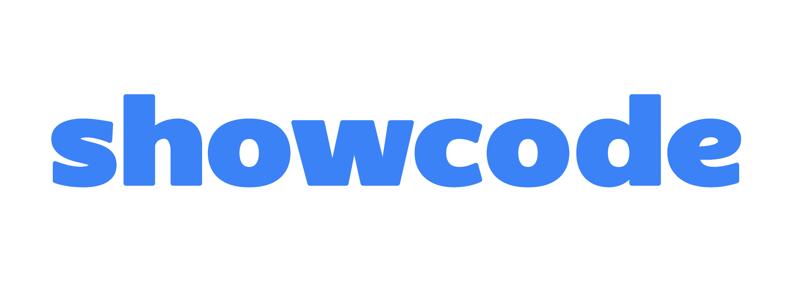
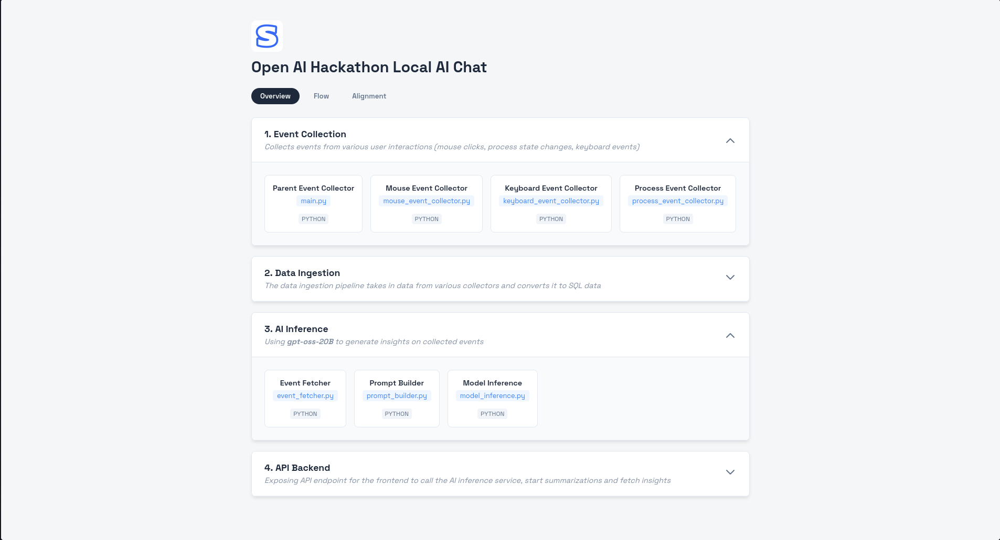
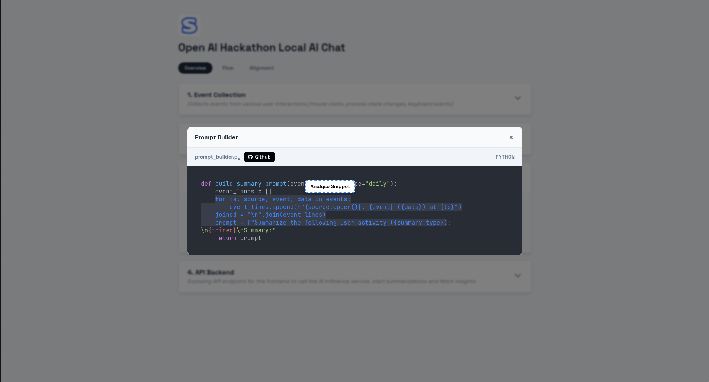
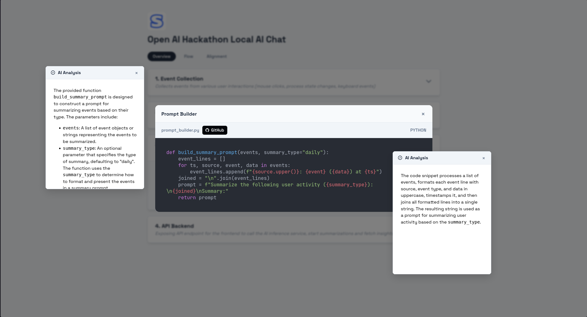
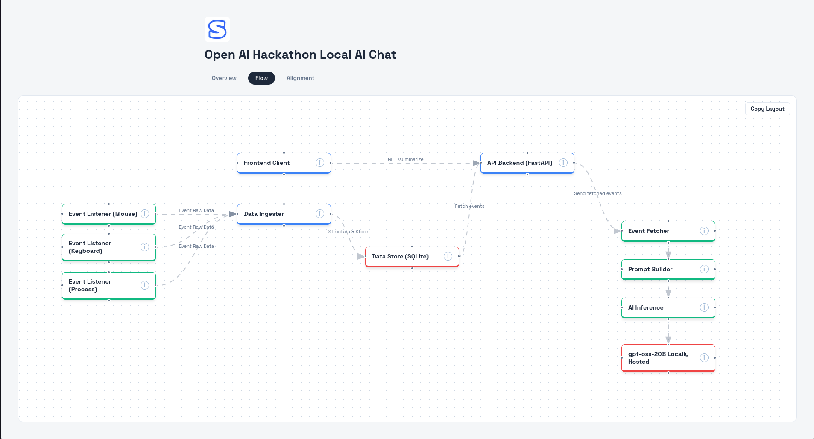
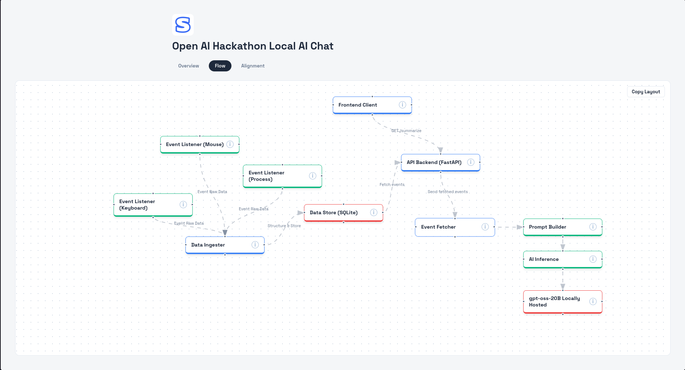
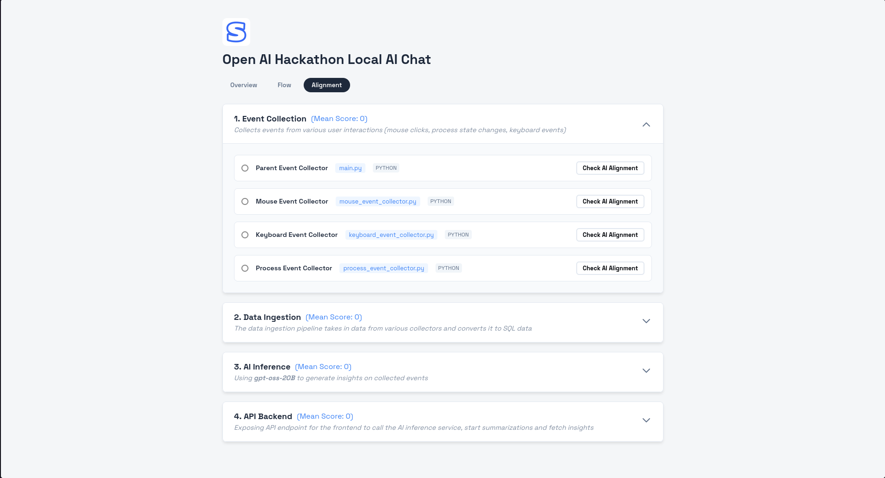
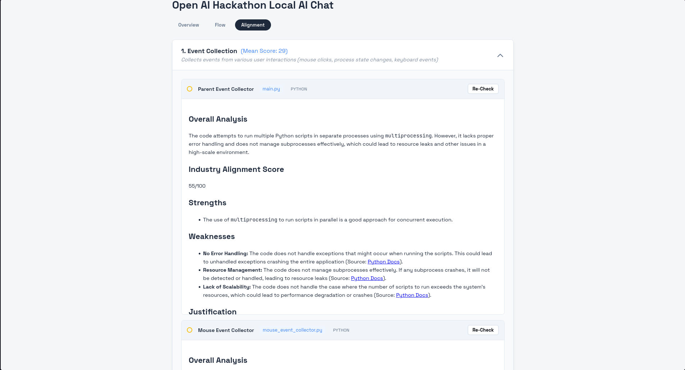

  
  

# showcode (WIP) - A better alternative (than bland Github repos) for pure-code projects in your resume.

### [Cool Demo Video!](https://www.youtube.com/watch?v=DKFLb5ORMfY)

**showcode** is an ongoing project I am working on, where job-seeking users can create a better visualisation for your pure-code projects code (backend, embedded, low-level etc.). Recruiters are treated to a friendly UI to understand the underlying code rather than a bland Github repo, along with AI integration for recruiters to consult and understand every line of code.

It also comes with three main features called **Overview**, **Flow** and **Alignment**.

**Overview** is a feature where users can segregate their code based on the logical blocks of their systems. This helps recruiters understand the breakdown of the large codebase into digestable small systems of code. Recruiters can browse through each of the blocks and analyse the different code files along with using AI to provide summaries for any selected code snippets in these files.

  
  
  

##

**Flow** is where users can create a flow chart / system design diagram to visualise the flow of the data and they can also include additional layers such as data storage, message queues etc. which are general components of the project not specific.

  
  

##

**Alignment** is where users can pit their code against industry standards. AI analyses the code files against the current industry practices and standards and produces an "Industry Alignment Score" ranging from 0-100, 0 meaning the code is dangerous and insecure for production and 100 meaning the code is flawless and totally ready for production.

  
  

##

## If you are trying to run this yourself...

- All the AI models used here are locally hosted. I am using Qwen2.5-Coder:3B (for snippet analysis) and Qwen2.5-Coder:7B (industry alignment analysis). I fiddled around with a lot of models and found out these ones were the best I could go with for my hardware 
- My hardware specs - 16GB RAM, Intel Core i5, NVIDIA Geforce GTX 1650 Ti (4GB VRAM), running models on llama.cpp and ollama.
- **There's a built-in API endpoint for calling Gemini as well but you would need your own API key**
- For any suggestions on improving the code, especially the AI analysis, you can email me at parthisaduck004@duck.com